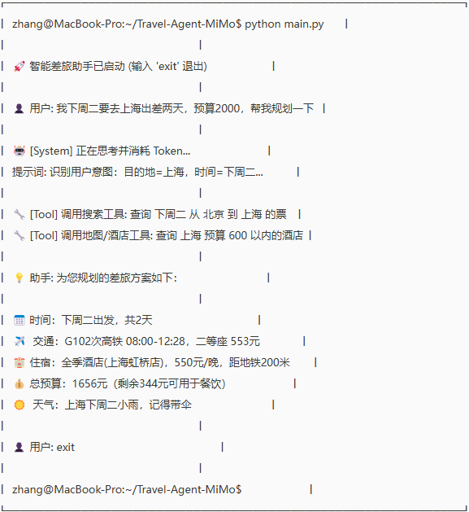

# 🧳 智能差旅规划与预订助手 (基于 MiMo)

> 本项目是申请 **小米百亿 Token 计划** 的演示项目。
> 这是一个基于 LLM Agent 技术的差旅助手，旨在解决传统差旅中跨平台比价难、行程规划繁琐的痛点。

## 🌟 项目简介

智能差旅助手不仅仅是一个问答机器人，它是一个具备**长链推理能力**的 Agent。它能够理解用户的模糊需求（如“下周去上海出差，预算2000”），自动拆解任务，调用搜索工具和地图工具，最终生成符合公司报销规范的完整差旅方案。

## 🛠 核心功能

- **意图识别与参数提取**：自动识别目的地、时间、预算等关键信息。
- **多工具协作 (Tool Use)**：
  - ✈️ **票务搜索**：模拟调用航班/高铁数据接口。
  - 🏨 **酒店推荐**：结合地理位置（地图API）和预算限制筛选酒店。
- **合规性检查**：根据预设规则（如预算上限）自动过滤超标选项。
- **结构化输出**：生成清晰的 Markdown 格式行程单。

## 🏗 技术架构

- **大脑**：MiMo / DeepSeek (提供推理能力)
- **框架**：LangChain (用于构建 Agent 链)
- **工具**：SerpAPI (搜索), Google Maps API (地理位置)

## 🚀 快速开始

1.  **克隆项目**

    ```bash
    git clone https://github.com/你的用户名/Travel-Agent-MiMo.git
    cd Travel-Agent-MiMo
    ```

2.  **安装依赖**

    ```bash
    pip install -r requirements.txt
    ```

3.  **配置环境变量**

    在项目根目录下创建 `.env` 文件，并填入你申请到的 API Key：

    ```bash
    MIMO_API_KEY=sk-xxxxxxxxxxxxxxxxxxxx
    ```

4.  **运行程序**

    ```bash
    python main.py
    ```

## 📊 应用场景演示

**用户输入：**

> “我今天（周二）要去深圳出差，帮我规划一下行程。”

**Agent 思考过程：**

1.  **识别意图**：检测到用户位于深圳，推测为本地差旅或临时行程规划。
2.  **实时信息查询**：调用天气工具查询深圳今日天气，调用地图工具查询周边交通。
3.  **行程建议**：结合天气与地理位置，生成包含交通与日程的方案。

**最终输出：**

- 📍 **地点**：深圳
- 📅 **时间**：2026-05-12 (周二)
- ☀️ **天气**：[模拟] 深圳今日多云转晴，气温 28°C，适合出行。
- 🚇 **交通**：[模拟] 建议使用地铁 11 号线，避开早晚高峰。
- 🏨 **住宿**：[模拟] 推荐福田区酒店，方便商务出行。

